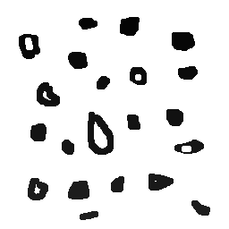

# labeling.cpp — preenchendo regiões com OpenCV

Observando-se o programa [labeling.cpp](https://agostinhobritojr.github.io/tutorial/pdi/labeling.html) como exemplo, é possível verificar que caso existam mais de 255 objetos na cena, o processo de rotulação poderá ficar comprometido, visto que o tipo de dado usado para suportar imagens cinzentas permitem armazenar apenas um byte por pixel. Identifique a situação em que isso ocorre e proponha uma solução para este problema.

Aprimore o algoritmo de contagem apresentado para identificar regiões com ou sem buracos internos que existam na cena. Assuma que objetos com mais de um buraco podem existir. Inclua suporte no seu algoritmo para não contar bolhas que tocam as bordas da imagem. Não se pode presumir, a priori, que elas tenham buracos ou não.

<p align="center">
  
</p>

<p align="center"><i>Figura 1: Imagem bolhas.</i></p>

---

## Problema
Imagens do tipo CV_8UC1 (8 bits por canal) só permitem valores de 0 a 255. Como o valor 0 geralmente representa o fundo, restam apenas 255 valores diferentes para representar objetos distintos. Se a imagem tiver mais de 255 regiões a serem rotuladas, os rótulos se repetem e não é mais possível distinguir corretamente todos os objetos.

### Solução
Para resolver esse problema, deve-se utilizar um tipo de imagem que suporte mais de 255 valores, como CV_16UC1 (imagem de 16 bits por pixel). Isso pode ser feito da seguinte forma:

```cpp
cv::Mat image = cv::imread("bolhas.png", cv::IMREAD_GRAYSCALE);
image.convertTo(image, CV_16UC1); // Converte para 16 bits
```

Com isso, é possível rotular até 65535 objetos diferentes, evitando ambiguidade de rótulos.


## Descrição da Tarefa

- Remover da contagem os objetos que tocam as bordas.

- Detectar e contar corretamente os objetos com e sem buracos.

- Garantir que objetos com múltiplos buracos sejam corretamente identificados.

---

## Trechos-chave do código


### 1. Rotulagem inicial com flood fill

```cpp
for (int i = 0; i < height; i++) {
    for (int j = 0; j < width; j++) {
      if (image.at<uchar>(i, j) == 255) {
        nobjects++;
        p.x = j;
        p.y = i;
        cv::floodFill(image, p, nobjects);
      }
    }
  }
```

### 2. Remoção de objetos conectados às bordas

```cpp
  for (int i = 0; i < height; ++i) {
    if (image.at<uchar>(i, 0) != 0 && image.at<uchar>(i, 0) != 255)
      cv::floodFill(image, cv::Point(0, i), 0);
    if (image.at<uchar>(i, width - 1) != 0 && image.at<uchar>(i, width - 1) != 255)
      cv::floodFill(image, cv::Point(width - 1, i), 0);
  }
  for (int j = 0; j < width; ++j) {
    if (image.at<uchar>(0, j) != 0 && image.at<uchar>(0, j) != 255)
      cv::floodFill(image, cv::Point(j, 0), 0);
    if (image.at<uchar>(height - 1, j) != 0 && image.at<uchar>(height - 1, j) != 255)
      cv::floodFill(image, cv::Point(j, height - 1), 0);
  }  
```
### 3. Contagem de objetos com buracos

```cpp
  cv::floodFill(image, cv::Point(0, 0), 255);

  int objetos_com_buracos = 0;
  std::set<int> ja_contados;

  for (int i = 0; i < height; ++i) {
    for (int j = 1; j < width; ++j) { // j começa em 1 para evitar j-1 < 0
      if (image.at<uchar>(i, j) == 0) {
        int cor_esquerda = image.at<uchar>(i, j - 1);

        if (cor_esquerda != 0 && cor_esquerda != 255 && ja_contados.find(cor_esquerda) == ja_contados.end()) {
          objetos_com_buracos++;
          ja_contados.insert(cor_esquerda);
        }

        // pinta o buraco para não contar ele de novo
        cv::floodFill(image, cv::Point(j, i), 254);
      }
    }
  }
```
## Resultados

O algoritmo conseguiu identificar corretamente o número de bolhas com e sem buracos, com os objetos tocando a borda da iamgem sendo excluídos da contagem, como exigido.

<p align="center">
  
</p>

<p align="center"><i>Figura 2: Imagem bolhas pós processamento.</i></p>

[veja]()
