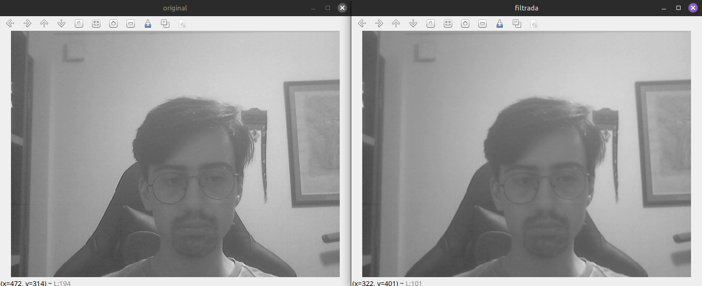
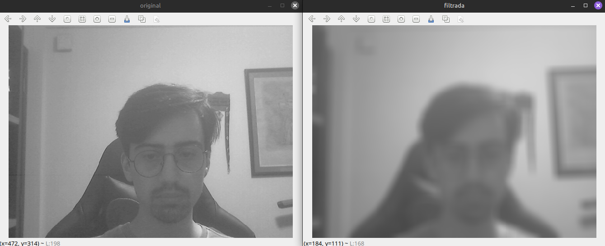

# convolucao2.cpp — convolução com o filtro da média para máscara 3x3, 11x11, 21x21

Utilizando o programa exemplos/convolucao.cpp como [referência](https://agostinhobritojr.github.io/tutorial/pdi/convolucao.html), implemente um programa convolucao2.cpp. O programa deverá realizar a convolução com o filtro da média para máscaras de tamanho 11×11e 21×21 pixels. Compare os resultados obtidos com o filtro de tamanho 3×3 pixels.

---

## Descrição da Tarefa

- Capturar imagens em tempo real da webcam.

- Converter cada frame para tons de cinza.

- Aplicar o filtro da média (convolução) com máscaras de 3x3, 11x11 e 21x21.

- Permitir a troca do tamanho da máscara durante a execução. (funcionalidade extra do programa)

- Exibir lado a lado a imagem original (em cinza) e a imagem filtrada.

---

## Trechos-chave do código

### 1. Captura da webcam e verificação de funcionamento
O programa utiliza a `cv::VideoCapture` para acessar a webcam padrão (índice 0).

```cpp
cv::VideoCapture cap;
int camera = cameraEnumerator();
cap.open(camera);

if (!cap.isOpened()) {
    std::cerr << "Erro ao abrir a câmera!" << std::endl;
    return -1;
}
```

### 2. Conversão para escala de cinza
A imagem é convertida para tons de cinza para facilitar o processamento com o filtro da média.

```cpp
cv::cvtColor(frame, gray, cv::COLOR_BGR2GRAY);
cv::flip(gray, gray, 1);
cv::imshow("original", gray);
```

### 3. Aplicação do filtro da média (convolução)
A convolução é feita com a função cv::filter2D, utilizando máscaras geradas dinamicamente.

```cpp
cv::Mat mask = createAverageKernel(kernelSize);
cv::filter2D(gray32f, filtered, CV_32F, mask);
```

A função createAverageKernel cria a máscara de média de acordo com o tamanho selecionado:

```cpp
cv::Mat createAverageKernel(int size) {
  float value = 1.0f / (size * size);
  return cv::Mat(size, size, CV_32F, cv::Scalar(value));
}
```
### 4. Troca do tamanho da máscara durante a execução
```cpp
    switch (key) {
      case '3':
        kernelSize = 3;
        mask = createAverageKernel(kernelSize);
        std::cout << "Kernel 3x3" << std::endl;
        break;
      case '1':
        kernelSize = 11;
        mask = createAverageKernel(kernelSize);
        std::cout << "Kernel 11x11" << std::endl;
        break;
      case '2':
        kernelSize = 21;
        mask = createAverageKernel(kernelSize);
        std::cout << "Kernel 21x21" << std::endl;
        break;
      default:
        break;
    }
```

## Resultados

Durante a execução, a imagem capturada é convertida para tons de cinza, exibida na janela "original" e suavizada com a máscara de média, exibida na janela "filtrada". A suavização se intensifica à medida que o tamanho da máscara aumenta, suavizando detalhes e ruídos.

<p align="center">
  
</p>

<p align="center"><i>Figura 1: Filtro médio com máscara 3x3.</i></p>

<p align="center">
  
</p>

<p align="center"><i>Figura 2: Filtro médio com máscara 11x11.</i></p>

<p align="center">
  
</p>

<p align="center"><i>Figura 3: Filtro médio com máscara 21x21.</i></p>

Quando a máscara é maior (por exemplo, 11×11 ou 21×21), ela considera mais vizinhos para calcular essa média. Quanto mais pixels são considerados, mais detalhes finos e ruídos locais são suavizados, pois eles têm menos influência no valor médio. Como consequência:

- Máscaras pequenas (3×3): preservam mais detalhes.

- Máscaras grandes (11×11, 21×21): geram imagens mais borradas e suaves.
