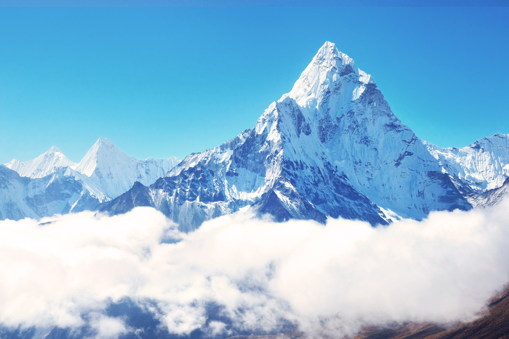
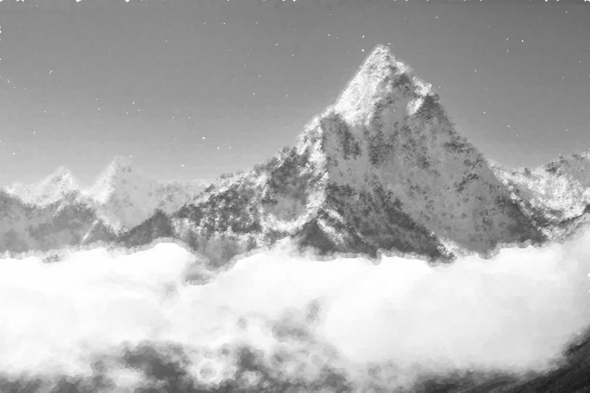

# cannypoints.cpp — pontilhismo com algoritmo de canny

Utilizando os programas canny.cpp e pontilhismo.cpp como [referência](https://agostinhobritojr.github.io/tutorial/pdi/canny.html), implemente um programa cannypoints.cpp. A idéia é usar as bordas produzidas pelo algoritmo de Canny para melhorar a qualidade da imagem pontilhista gerada. A forma como a informação de borda será usada é livre. 

---

## Descrição da Tarefa passo a passo

- Criar uma imagem pontilhista com pontos distribuídos em uma grade com jitter aleatório.

- Aplicar o algoritmo de Canny com múltiplos limiares (10 até 70) para detectar bordas em diferentes níveis de detalhe.

- Reforçar as regiões de contorno desenhando círculos menores e mais densos nas bordas detectadas, sobre a imagem pontilhista.

- Produzir uma imagem final com textura artística nas áreas suaves e definição realçada nos contornos.

---

## Trechos-chave do código

### 1. Criação da grade pontilhista e sorteio com jitter

```cpp
std::vector<int> xrange(height / STEP);
std::vector<int> yrange(width / STEP);
std::iota(xrange.begin(), xrange.end(), 0);
std::iota(yrange.begin(), yrange.end(), 0);

for (size_t i = 0; i < xrange.size(); i++)
  xrange[i] = xrange[i] * STEP + STEP / 2;
```

### 2. Desenho da imagem pontilhista base

```cpp
int jittered_x = x + std::rand() % (2 * JITTER + 1) - JITTER;
int jittered_y = y + std::rand() % (2 * JITTER + 1) - JITTER;
cv::circle(canvas, cv::Point(jittered_y, jittered_x), RAIO,
           cv::Scalar(gray, gray, gray), cv::FILLED, cv::LINE_AA);

```

### 3. Aplicação do algoritmo de Canny e reforço das bordas

```cpp
for (int i = 0; i < CANNY_STEPS; ++i) {
  int t_low = 10 + i * 20;
  int t_high = 3 * t_low;
  cv::Canny(image, edges, t_low, t_high);

  int raio_borda = std::max(1, RAIO - i);

  for (int y = 0; y < edges.rows; ++y) {
    for (int x = 0; x < edges.cols; ++x) {
      if (edges.at<uchar>(y, x) != 0) {
        int gray = image.at<uchar>(y, x);
        cv::circle(canvas, cv::Point(x, y), raio_borda,
                   cv::Scalar(gray, gray, gray), cv::FILLED, cv::LINE_AA);
      }
    }
  }
}

```

## Resultados

A imagem final contém:

- Regiões homogêneas preenchidas com pontos espaçados de tamanho uniforme.

- Regiões de contorno com pontos mais densos e menores, capturados pelas bordas de Canny em diferentes níveis.

- Transição visual natural entre áreas lisas e detalhadas.

<p align="center">
  
</p>

<p align="center"><i>Figura 1: imagem original.</i></p>

<p align="center">
  
</p>

<p align="center"><i>Figura 2: imagem com pontilhismo.</i></p>
.
