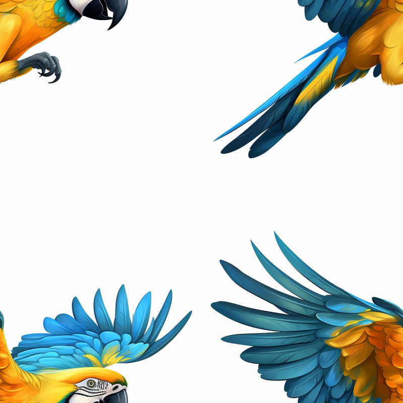

# trocaregions.cpp — Troca de quadrantes diagonais com OpenCV

Utilizando o programa da **Listagem 4**, “pixels.cpp” como [referência](https://agostinhobritojr.github.io/tutorial/pdi/pixels.html), implemente um programa `trocaregions.cpp`. Seu programa deverá trocar os quadrantes em diagonal na imagem. Explore o uso da classe `cv::Mat` e seus construtores para criar as regiões que serão trocadas. O efeito é ilustrado na Figura 1, “Exemplo de saída do programa trocaregions.cpp”. Assuma que a imagem de entrada tem dimensões múltiplas de 2 para facilitar a implementação do processo de troca.

<p align="center">
  
</p>

<p align="center"><i>Figura 1: Troca dos quadrantes diagonais na imagem original.</i></p>

---
## Descrição da Tarefa

Inspirado na **Listagem 4 ("pixels.cpp")** do material de estudo sobre acesso a pixels com OpenCV, o objetivo desta tarefa é desenvolver um programa chamado `trocaregions.cpp` com as seguintes funcionalidades:

- Carregar uma imagem (`imagem.jpg`) em modo **colorido**.
- Dividir a imagem em quatro quadrantes iguais.
- Trocar os quadrantes em diagonal:  
  - superior esquerdo ↔ inferior direito  
  - superior direito ↔ inferior esquerdo
- Exibir a imagem modificada em uma janela.

---

## Trechos-chave do código

### 1. Carregamento da imagem

Este trecho usa a função `cv::imread` para abrir o arquivo `"imagem.jpg"` no modo `IMREAD_COLOR`, mantendo as três bandas de cor (BGR). Um teste é feito para garantir que a imagem foi carregada corretamente.

```cpp
cv::Mat imagem = cv::imread("imagem.jpg", cv::IMREAD_COLOR);
if (imagem.empty()) {
    std::cerr << "Erro ao carregar a imagem!" << std::endl;
    return -1;
}
```

### 2. Definição dos quadrantes usando ROI (regiões de interesse)
A imagem é dividida em quatro quadrantes utilizando cv::Rect, que define regiões de interesse com base nas dimensões da imagem.

```cpp
int meio_linha = imagem.rows / 2;
int meio_coluna = imagem.cols / 2;

cv::Mat A = imagem(cv::Rect(0, 0, meio_coluna, meio_linha));                         // superior esquerdo
cv::Mat B = imagem(cv::Rect(meio_coluna, 0, meio_coluna, meio_linha));               // superior direito
cv::Mat C = imagem(cv::Rect(0, meio_linha, meio_coluna, meio_linha));                // inferior esquerdo
cv::Mat D = imagem(cv::Rect(meio_coluna, meio_linha, meio_coluna, meio_linha));      // inferior direito
```

### 3. Troca dos quadrantes diagonais
Antes da troca, os quadrantes são clonados para preservar os dados originais.  Depois, os dados são copiados para as regiões opostas, realizando a troca dos quadrantes diagonais.
```cpp
cv::Mat A_clone = A.clone();
cv::Mat B_clone = B.clone();
cv::Mat C_clone = C.clone();
cv::Mat D_clone = D.clone();

A_clone.copyTo(D);
D_clone.copyTo(A);
B_clone.copyTo(C);
C_clone.copyTo(B);
```

## Resultados
<p align="center">
  
</p>

<p align="center"><i>Figura 2: Imagem original.</i></p>

<p align="center">
  
</p>

<p align="center"><i>Figura 3: Imagem editada.</i></p>
