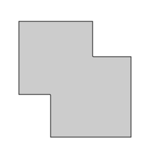

# contornos.cpp — extração de contornos

Utilizando o programa contornos.cpp como [referência](https://agostinhobritojr.github.io/tutorial/pdi/contornos.html), aplique-o na extração do contorno da imagem retangulos.png mostrada na Figura 55, “Retângulos superpostos”. Quantos pontos são gerados para o contorno dos retângulos?

Modifique o programa para extrair os contornos internos das componentes conectadas presentes na imagem formas.png. Para isso, altere o parâmetro cv::CHAIN_APPROX_NONE para cv::CHAIN_APPROX_SIMPLE na função findContours(). O que acontece com os novos contornos extraídos? Mostre quantos pontos são gerados após a alteração e discuta como a modificação do parâmetro cv::CHAIN_APPROX_SIMPLE influencia na extração do contorno.

---

## Descrição da Tarefa passo a passo

- Aplicar binarização automática utilizando o método de Otsu com inversão de tons para destacar os objetos (objetos tornam-se brancos, fundo preto).

- Detectar os contornos de todos os objetos da imagem utilizando a função cv::findContours() da biblioteca OpenCV.

- Testar os dois modos de aproximação de contorno:

  cv::CHAIN_APPROX_SIMPLE: armazena apenas os vértices significativos dos contornos.

  cv::CHAIN_APPROX_NONE: armazena todos os pontos dos contornos, preservando os detalhes completos.

- Gerar visualizações com os contornos desenhados sobre a imagem original, bem como arquivos SVG com os contornos vetorizados.
  
- Contar e exibir o número total de pontos em todos os contornos (para comparar os métodos SIMPLE e NONE).

---

## Trechos-chave do código

### 1. Leitura da imagem e binarização

```cpp
cv::Mat image = cv::imread(argv[1], cv::IMREAD_GRAYSCALE);
cv::threshold(image, image, 0, 255, cv::THRESH_BINARY_INV + cv::THRESH_OTSU);
```

### 2. Extração dos contornos

```cpp
std::vector<std::vector<cv::Point>> contours;
std::vector<cv::Vec4i> hierarchy;

cv::findContours(image, contours, hierarchy, cv::RETR_TREE, cv::CHAIN_APPROX_NONE); // ou CHAIN_APPROX_SIMPLE
```

### 3. Desenho dos contornos e geração de SVG

```cpp
for (size_t i = 0; i < contours.size(); i++) {
  file << "<path d=\"M " << contours[i][0].x << " " << contours[i][0].y << " ";
  for (size_t j = 1; j < contours[i].size(); j++) {
    file << "L" << contours[i][j].x << " " << contours[i][j].y << " ";
  }
  file << "Z\" fill=\"none\" stroke=\"black\" stroke-width=\"1\" />" << std::endl;
  cv::drawContours(image, contours, i, CV_RGB(255, 0, 0), 1);
}
```

## Resultados

Para a imagem dos retângulos, contou-se x pontos para realizar o contorno. Já na formas.png, foram detectados múltiplos contornos na imagem, correspondentes aos parafusos, buchas e arruelas presentes na cena.

<p align="center">
  
</p>

<p align="center"><i>Figura 1: contorno retângulo. (clique na imagem para ver melhor)</i></p>

Com [CHAIN_APPROX_SIMPLE](https://github.com/josemartins36/-UFRN-Processamento-Digital-de-Imagens/blob/main/Cap%C3%ADtulo%2021%2C%20Extra%C3%A7%C3%A3o%20de%20contornos/contornos_mod/build/approx_simple.txt):

- O número total de pontos nos contornos foi significativamente menor (6547).

- Ideal para representar a forma geral dos objetos com economia de memória.

Com [CHAIN_APPROX_NONE](https://github.com/josemartins36/-UFRN-Processamento-Digital-de-Imagens/blob/main/Cap%C3%ADtulo%2021%2C%20Extra%C3%A7%C3%A3o%20de%20contornos/contornos_mod/build/approx_none.txt):

- O número total de pontos aumentou bastante (de 6547 foi para 10945), preservando todos os detalhes finos dos contornos.

- Mais custoso computacionalmente, mas com maior precisão na forma.
