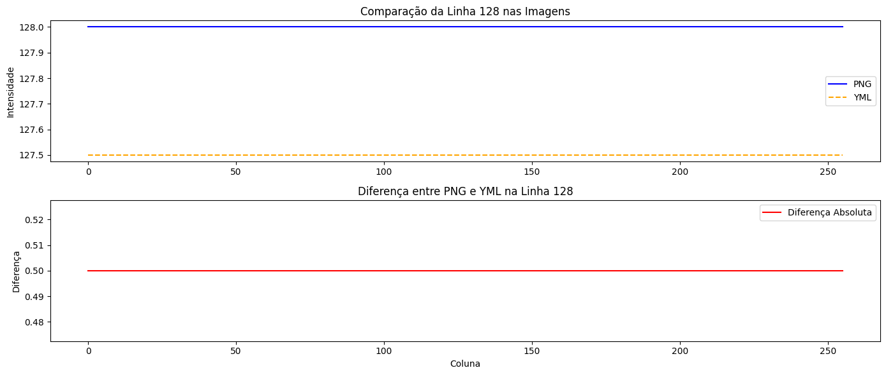

# filestorage.cpp — Análise de Precisão na Representação de Imagens PNG versus YML

Utilizando o programa-exemplo filestorage.cpp como base, crie um programa que gere uma imagem de dimensões 256x256 pixels contendo uma senóide de 4 períodos com amplitude igual 127 desenhada na horizontal, semelhante àquela apresentada na Figura 11, “Saída do programa filestorage”. Grave a imagem no formato YML e também em formato PNG, como faz o programa-exemplo. Compare os arquivos gerados, extraindo uma linha correspondente de cada imagem gravada e comparando a diferença entre elas. Trace um gráfico da diferença calculada ao longo da linha correspondente extraída nas imagens. O que você observa? Por que isso acontece?

## Descrição da Tarefa

Inspirado na abordagem do exemplo `filestorage.cpp` no material de estudo, o objetivo desta tarefa é desenvolver um programa com as seguintes funcionalidades:

- Gerar uma imagem de **256x256 pixels** contendo uma **senóide com 4 períodos e amplitude 127**, desenhada horizontalmente.
- Salvar a imagem nos seguintes formatos:
  - **YML**, utilizando `cv::FileStorage`.
  - **PNG**, utilizando `cv::imwrite`.
- Recarregar as imagens gravadas nos dois formatos.
- **Extrair uma linha (linha central, por exemplo, a linha 128)** de cada imagem.
- Calcular a **diferença absoluta** entre os valores dos pixels das duas linhas extraídas.
- Exibir um **gráfico da diferença** ao longo da linha comparada.

---

## Trechos-chave do código

### 1. Geração da senóide
A geração da senoide na horizontal (varia com i, constante em j) ->float value = 127 * std::sin(2 * M_PI * PERIODOS * **i** / SIDE) + 128;

```cpp
for (int i = 0; i < SIDE; ++i) {
  float value = 127 * std::sin(2 * M_PI * PERIODOS * i / SIDE) + 128;
  for (int j = 0; j < SIDE; ++j) {
    image.at<float>(i, j) = value;
  }
}

```
### 2. Salvando em YML
```cpp
cv::FileStorage fs("senoide_horizontal-256.yml", cv::FileStorage::WRITE);
fs << "mat" << image;
fs.release();
```

### 3. Salvando em PNG
```cpp
cv::Mat image_8u;
cv::normalize(image, image_8u, 0, 255, cv::NORM_MINMAX);
image_8u.convertTo(image_8u, CV_8U);
cv::imwrite("senoide_horizontal-256.png", image_8u);
```

A análise comparativa entre os arquivos gerados nos formatos PNG e YML foi realizada utilizando Python por ser uma linguagem mais prática e expressiva para esse tipo de tarefa. Com o auxílio das bibliotecas OpenCV e Matplotlib, foi possível ler os arquivos, extrair os dados relevantes e gerar os gráficos de forma rápida e intuitiva. Por isso, optei por realizar a parte analítica neste ambiente, facilitando tanto a manipulação dos dados quanto a visualização dos resultados.

### 4. Comparando diferenças

```python
import cv2
import numpy as np
import matplotlib.pyplot as plt

# Leitura da imagem PNG como float
img_png = cv2.imread("senoide_horizontal-256.png", cv2.IMREAD_GRAYSCALE).astype(np.float32)

# Leitura da imagem YML
fs = cv2.FileStorage("senoide_horizontal-256.yml", cv2.FileStorage_READ)
img_yml = fs.getNode("mat").mat()
fs.release()

# Normalizar a imagem YML para 0-255 como no C++
img_yml_norm = cv2.normalize(img_yml, None, 0, 255, cv2.NORM_MINMAX)

# Comparação na linha 128
linha = 128
linha_png = img_png[linha, :]
linha_yml = img_yml_norm[linha, :]

# Diferença em float
diferenca = np.abs(linha_png - linha_yml)

# Gráfico
plt.figure(figsize=(14, 6))

plt.subplot(2, 1, 1)
plt.plot(linha_png, label="PNG", color='blue')
plt.plot(linha_yml, label="YML", color='orange', linestyle='--')
plt.title("Comparação da Linha 128 nas Imagens")
plt.ylabel("Intensidade")
plt.legend()

plt.subplot(2, 1, 2)
plt.plot(diferenca, label="Diferença Absoluta", color='red')
plt.title("Diferença entre PNG e YML na Linha 128")
plt.xlabel("Coluna")
plt.ylabel("Diferença")
plt.legend()

plt.tight_layout()
plt.show()
```
### 5. Resultados
<p align="center">
  
</p>

<p align="center"><i>Figura 1: comparação da linha 128 das imagens.</i></p>
